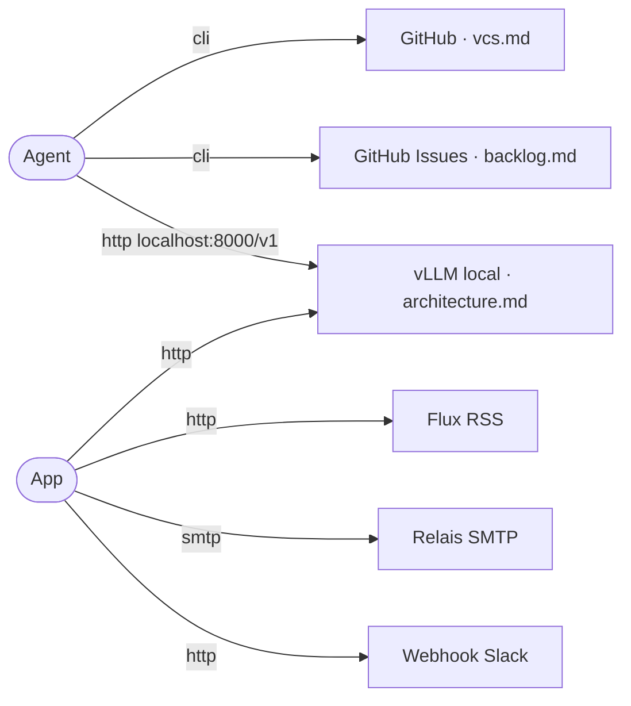

# Ecosystem

```mermaid
flowchart LR
  Agent([Agent])
  App([App])
  GitHub["GitHub · vcs.md"]
  Issues["GitHub Issues · backlog.md"]
  VLLM["vLLM local · architecture.md"]
  SMTP["Relais SMTP"]
  Slack["Webhook Slack"]
  RSS["Flux RSS"]

  Agent -- cli --> GitHub
  Agent -- cli --> Issues
  Agent -- "http localhost:8000/v1" --> VLLM
  App -- http --> VLLM
  App -- http --> RSS
  App -- smtp --> SMTP
  App -- http --> Slack
```
